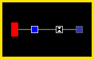

# Desafio de Programação

O desafio é criar um jogo em Javascript utilizando a engine gráfica [PixiJS](http://www.pixijs.com/) e a biblioteca de animações [GSAP](https://greensock.com/).

## Visão Geral

Nesse jogo, o objetivo é que o bloco inicial (no lado esquerdo da tela) tenha a mesma aparência do bloco final (mais à direita).
Para isso, deverão ser utilizados os blocos intermediários (com contorno branco), que alteram o tamanho e a cor do bloco inicial.

## Especificação Técnica

O projeto deverá ser desenvolvido utilizando [PixiJS](http://www.pixijs.com/) e [GSAP](https://greensock.com/). O desenvolvedor poderá utilizar transpiladores, ferramentas ou bibliotecas adicionais.

A aparência das telas mostradas aqui devem ser usadas apenas como referência. Quando apropriado (ex: blocos), os elementos gráficos deverão ser gerados em tempo de execução.

### Interação e Animação

Em todos os níveis, o jogador deverá clicar/tocar no bloco inicial para que seja feita a validação da resposta,
em que o bloco inicial se move pela linha cinza, recebendo os modificadores conforme passa por cada um.

Ao chegar no final da linha, o jogo deverá carregar o próximo nível, caso o resultado esteja correto.
Caso contrário, o nível atual deverá ser reiniciado.

Para simplificar esse desafio, apenas o último nível permite a interação do jogador. Nele, o jogador poderá clicar sobre o modificador vazio, alternando entre as possibilidades dadas.

### Configuração de Níveis

Todos os níveis deverão ser construídos conforme o arquivo de configuração `levels.json`. Esse arquvio contém um array de níveis, que seguem o formato:

- **name**: usado para identificar o nível, pode ser exibido na tela
- **initial**: estado do bloco inicial
    - **size**: altura, em unidades de largura (ex: `size: 1` é um quadrado)
    - **color**: cor do bloco, em formato CSS (ex: `#f00`, `rgba(255,0,0,1)`, etc)
- **final**: estado do bloco final (segue o padrão do campo `initial`)
- **modifiers**: array de modificadores, na ordem em que são encontrados

Cada modificador tem um campo `type`, que pode assumir um dos valores abaixo:

- **colorize**: altera a cor do bloco inicial, conforme o parâmetro **color**
- **resize**: altera a tamanho do bloco inicial, conforme o parâmetro **size**
- **select**: permite que o jogador selecione entre uma das opções dadas no parâmetro **options**

### Levels

#### 00 - Growing

Nesse nível é apresentado o modificado `resize`, aumentando o tamanho do bloco inicial para 2.

#### 01 - Let it Blue

Nesse nível é apresentado o modificado `colorize`, que altera a cor do bloco inicial para azul.

#### 02 - Pulsating

Nesse nível o bloco sofre duas alterações, aumentando e diminuindo seu tamanho.

#### 03 - Mix and Match

Nível que junta dois modificadores diferentes, alterando o tamanho e a cor do bloco.

#### 04 - Time to Choose

Único nível onde permite que o jogador escolha entre diversos modificadores. Neste, o jogador deve selecionar a opção `resize`, para aumentar o tamanho do bloco.

## Tarefas Opcionais

Para ir além da tarefa principal descrita a cima, você pode escolher quaisquer tarefas a seguir para realizar. As tarefas são descritas brevemente, por isso use sua imaginação para interpretar cada uma delas.

### Integração com API

Criamos uma API HTTP para você integrar ao seu jogo. Confira a seguir os endpoints disponível.

Importante: o corpo de todas requisições e respostas são formatadas com JSON.

#### Carregar Lista de Níveis

- **Método**: GET
- **URL**: https://teste.pushstart.com.br/api/blocks/levels
- **Resposta**: o conteúdo do `levels.json`

#### Registrar Score ao fim de um Nível

- **Método**: POST
- **URL**: https://teste.pushstart.com.br/api/blocks/scores
- **Requisição**: `{"levelName": "Mix and Match", "score": 18291}` (score é o tempo em milisegundos para finalizar o nível)
- **Resposta**: a lista dos melhores tempos para esse nível para serem exibidos

### Gerador de Níveis

O jogador leva só alguns minutos para terminar o `level.json`. Crie um gerador de níveis aleatórios compatíveis com o seu jogo.

### Melhorias Visuais

Explore uma nova identidade visual para o jogo. Use sua imaginação!

### Menu de Seleção de Níveis

Crie um menu onde o jogador pode selecionar níveis desbloqueados para jogar novamente.

### Melhore a Documentação

Nos ajude a entender um pouco mais do que você criou. Para isso você pode documentar seu código, criar um manual para o jogo, fazer um vídeo tutorial, etc

### Crie um Replay

Após responder um nível, você pode fazer com que o jogador controle a exibição da animação, pausando ou voltando para um ponto, como num vídeo do YouTube.

### Teste seu Jogo

Para garantir que seu jogo está funcionando, você pode escrever teste para ele. Pode ser testes unitários automáticos ou até mesmo roteiros manuais para a equipe de testes.